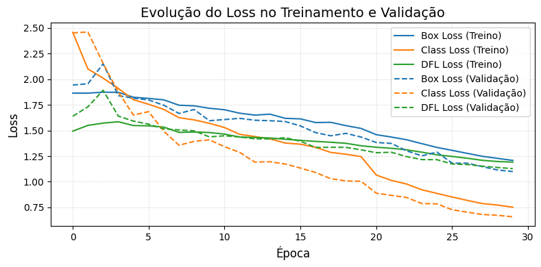
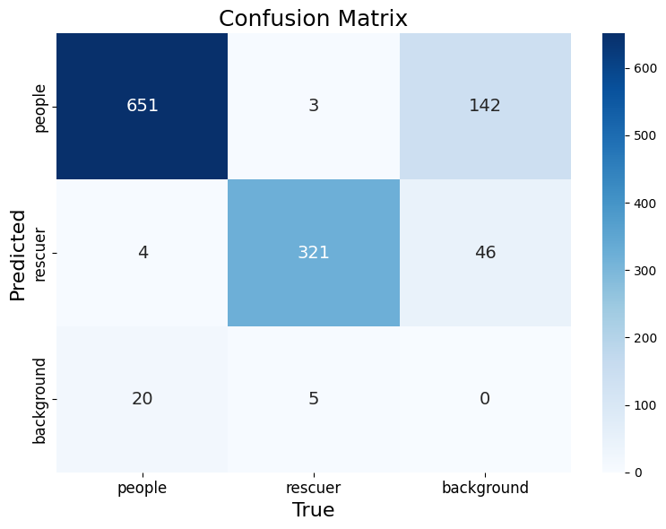
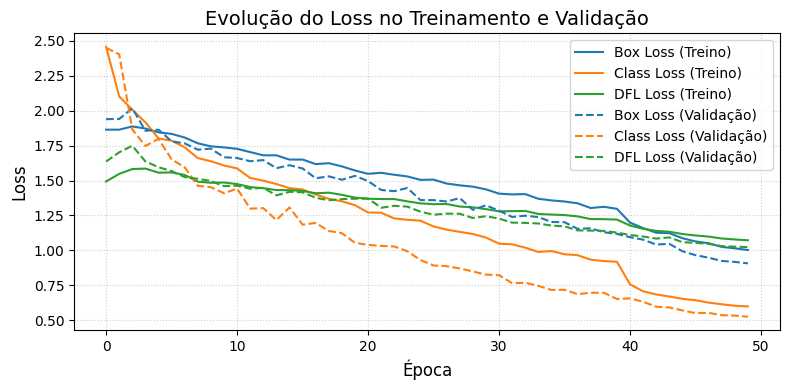
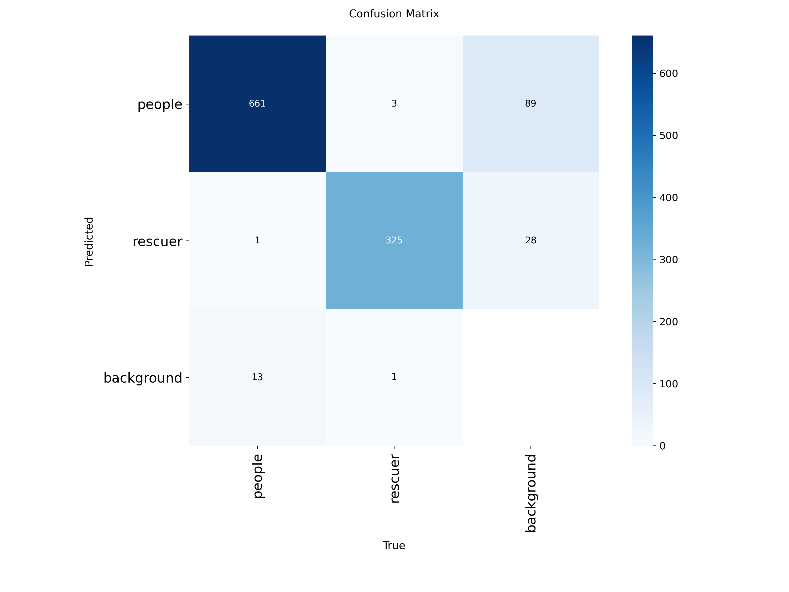
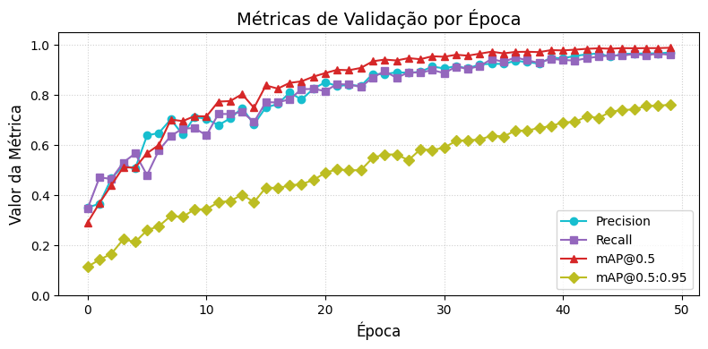

<div align="center"\>

# Urban Disaster Monitor

[](https://www.google.com/search?q=https://docs.ultralytics.com/models/yolov8/%23yolov8-usage-examples) [](https://colab.research.google.com/drive/1ids-NQ6EfzGgfK41BWvkIXxOkUomexo0?usp=sharing) [](https://github.com/MariaCarolinass/urban-disaster-monitor/blob/main/LICENSE.txt)

[App](https://huggingface.co/spaces/carolinasoares/urban_disaster_monitor) | [Dataset](https://github.com/MariaCarolinass/urban-disaster-monitor/tree/main/dataset)

[English](./README.md) | [Português](./README.pt.md)

</div\>

# Urban Disaster Monitor: Detection and Classification of People in Disaster Scenarios

An intelligent computer vision system for **detecting and classifying civilians and rescuers** in urban disaster scenarios, using **YOLOv8**.

<div align="center"\>


</div\>

---

🛑 In urban disaster situations, every second matters. This project offers a computer vision tool to help rescue teams act with greater precision and speed.

---

## 📑 Summary

- [Project Structure](https://www.google.com/search?q=%23-project-structure)
- [Features](https://www.google.com/search?q=%23-features)
- [Introduction](https://www.google.com/search?q=%23-introduction)
- [Dataset](https://www.google.com/search?q=%23-dataset)
- [Methodology](https://www.google.com/search?q=%23%25EF%25B8%258F-methodology)
  - [Data Acquisition and Annotation](https://www.google.com/search?q=%23data-acquisition-and-annotation)
  - [Data Pre-processing](https://www.google.com/search?q=%23data-pre-processing)
  - [Model Architecture and Tools](https://www.google.com/search?q=%23model-architecture-and-tools)
  - [Model Training and Optimization](https://www.google.com/search?q=%23model-training-and-optimization)
- [Results and Discussions](https://www.google.com/search?q=%23-results-and-discussions)
  - [Results and Metrics Analysis](https://www.google.com/search?q=%23results-and-metrics-analysis)
  - [Evaluation on Static Images](https://www.google.com/search?q=%23evaluation-on-static-images)
  - [Evaluation on Video](https://www.google.com/search?q=%23evaluation-on-video)
  - [Charts and Visualizations](https://www.google.com/search?q=%23charts-and-visualizations)
  - [Future Work](https://www.google.com/search?q=%23future-work)
- [Conclusion](https://www.google.com/search?q=%23-conclusion)
- [Interactive Interface](https://www.google.com/search?q=%23-interactive-interface)
- [Technologies](https://www.google.com/search?q=%23%25EF%25B8%258F-technologies)
- [Project Team](https://www.google.com/search?q=%23-project-team)
- [How to Run](https://www.google.com/search?q=%23-how-to-run)
- [License](https://www.google.com/search?q=%23-license)
- [Bibliographical References](https://www.google.com/search?q=%23-bibliographical-references)

---

## 📁 Project Structure

```
urban-disaster-monitor/
├── app/
│   ├── examples/
│   ├── models/
│   │   └── best30p.pt
|   |   └── best50p.pt
│   ├── app.py
│   ├── requirements.txt
│   ├── README.md
├── dataset/
│   ├── test/
│   ├── train/
│   ├── val/
│   ├── data.yaml/
│   └── README.md
├── notebooks/
│   │   └── urban_disaster_monitor.ipynb
├── static/
│   ├── images/
│   ├── graphics/
│   └── matrix/
│   └── gif/
├── config.py
├── train.py
├── README.md
└── LICENSE
```

---

## 🔍 Features

- Detection of people in **images** and **videos**
- Differentiation between **civilians** and **rescuers**
- Training with **YOLOv8**
- Interactive interface via **Gradio**
- Visualization of **metrics and bounding boxes**

---

## 📌 Introduction

**Urban disaster** events, such as structural collapses, floods, and landslides, pose significant challenges to response and rescue operations. The ability to **quickly identify and categorize** individuals as civilians or rescuers in real-time is crucial for optimizing resource allocation and minimizing fatalities. Images collected by unmanned aerial vehicles (UAVs), surveillance systems, and mobile devices represent a valuable data source for this purpose.

This project proposes the development of an **intelligent computer vision system** for the **discriminative detection and classification of individuals (civilians and rescuers)** in environments impacted by urban disasters. Using the **YOLOv8 (You Only Look Once, version 8) object detection architecture**, the goal is to build a robust and efficient tool capable of providing critical support to authorities and emergency teams during the disaster response phase.

Developed during the Computer Vision course at the **School of Science and Technology (ECT/UFRN)** as a volunteer effort for the **Smart Metropolis Lab (SMLab)** of the **Metrópole Digital Institute (IMD/UFRN)**, this work is an integral part of the **SPICI Project (Integrated Public Safety in Smart Cities)**. SPICI aims to create an intelligent platform for collecting, processing, and analyzing images and critical information in real-time, contributing to crisis and disaster management through advanced technologies like computer vision and artificial intelligence. The `Urban Disaster Monitor` directly aligns with SPICI's objectives by providing a specialized tool for identifying people in disaster scenarios, adding value to the platform's response and decision-making capabilities.

<div align="center"\>

<a href="[https://smlab.imd.ufrn.br/](https://smlab.imd.ufrn.br/)"\>\\</a\>\<a href="[https://smlab.imd.ufrn.br/projeto-spici/](https://smlab.imd.ufrn.br/projeto-spici/)"\>\\</a\>\<a href="[https://imd.ufrn.br/](https://imd.ufrn.br/)"\>\\</a\>\<a href="[https://www.ect.ufrn.br/](https://www.ect.ufrn.br/)"\>\\</a\>

</div\>

---

## 📂 Dataset

- **Total images**: 2403
- **Sources**: real data plus synthetic images
- **Classes**:
  - `people` (civilians)
  - `rescuer` (rescuers with PPE)
- **Annotated via**: [Roboflow](https://universe.roboflow.com/ufrnprojects-xlut9/urban-disaster-monitor/)
- **Annotation Format**: `.txt` files containing the coordinates of the _bounding boxes_ and class IDs, accompanied by the corresponding images, following YOLO's naming convention.

---

## ⚙️ Methodology

- Architecture: `YOLOv8s` and `YOLOv8n`
- Data augmentation: rotation, noise, brightness, etc.
- Training: 30 and 50 epochs compared
- Main metrics:
  - `mAP@0.5`, `mAP@0.5:0.95`
  - `Precision`, `Recall`
  - Confusion matrix

### Data Acquisition and Annotation

For model training and validation, a **comprehensive dataset** was compiled, consisting of various images representing typical urban disaster scenarios (e.g., collapsed buildings, flooded areas). The sources include **public repositories of disaster images** and the **generation of synthetic images** to supplement the dataset's variability. This hybrid approach aims to mitigate the scarcity of high-quality real data in disaster environments.

The **annotation of objects of interest** is being carried out on the **Roboflow** platform, where the primary classes of interest are defined as:

- `People`: Individuals not identified as members of rescue teams.
- `Rescuer`: Individuals equipped or identifiable as part of emergency teams (e.g., firefighters, paramedics), often distinguishable by uniforms, personal protective equipment (PPE), or operational postures.

### Data Pre-processing

Pre-processing steps are crucial for optimizing model performance and ensuring its generalization:

- **Resizing**: All images are scaled to dimensions compatible with the YOLOv8 architecture's inputs, balancing visual information fidelity with computational efficiency.
- **Data Augmentation**: Data augmentation techniques (e.g., rotation, translation, mirroring, brightness and contrast adjustment, blurring, and noise) are applied to increase the model's robustness, mitigate the risk of overfitting, and compensate for potential class imbalances. Diversifying the dataset through data augmentation is fundamental to simulating the variability of image conditions in real disaster scenarios.
- **Partitioning**: The dataset is divided into training, validation, and test sets, typically in the proportions 70%, 20%, and 10%, respectively. This stratified division ensures an unbiased evaluation of the model's ability to generalize to unseen data.

### Model Architecture and Tools

- **Detection Model**: **YOLOv8 (You Only Look Once, version 8)**. This architecture was selected for its proven efficiency in real-time object detection, combining high accuracy with inference speed, which are essential characteristics for applications in emergency scenarios.
- **Task**: Object Detection.
- **Frameworks and Libraries**: The model development and training are carried out with **Ultralytics YOLOv8**, using **PyTorch** as the deep learning backend, and **OpenCV** for image manipulation and video pre-processing.

### Model Training and Optimization

The training process involves the following phases, aiming to optimize the model's performance:

1.  **Annotation Conversion**: Annotations generated in the Roboflow format are converted to the YOLO format (`.txt`), which is the standard input for models in the YOLO family.
2.  **Iterative Training**: The model is trained using a set of optimized parameters, including batch size, learning rate, and number of epochs. Learning rate schedulers and optimizers (e.g., Adam, SGD) are employed to accelerate convergence and improve performance.
3.  **Continuous Validation**: The model's performance is monitored and validated in real-time during training using standard performance metrics from the field on a separate validation set. This allows for the identification of overfitting and dynamic adjustment of hyperparameters.
4.  **Testing and Evaluation**: After training, the model is extensively evaluated on an independent test set, containing real images and unseen scenarios, to verify its generalization ability and robustness under adverse conditions.

<div align="center"\>


_Image training step_

</div\>

---

## 📊 Results and Discussions

### Results and Metrics Analysis

The model's effectiveness was evaluated through a set of quantitative and qualitative metrics, providing a comprehensive analysis of its performance:

- **Mean Average Precision (mAP) Metrics**:
  - **mAP@0.5**: Mean Average Precision calculated with an IoU (Intersection over Union) threshold of 0.5. This metric is commonly used for a quick assessment of detection accuracy.
  - **mAP@0.5:0.95**: Mean Average Precision calculated over multiple IoU thresholds, ranging from 0.5 to 0.95 in steps of 0.05. This metric offers a more robust and comprehensive measure of the localization and classification accuracy of the detections.
- **Precision and Recall**: Evaluated per class to understand individual performance in identifying civilians and rescuers, indicating the proportion of correct detections and the model's ability to find all relevant instances, respectively.
- **Confusion Matrix**: Essential for visualizing and analyzing the types of errors (false positives, false negatives) made by the model, especially the confusion between the classes of interest, which is critical in scenarios where the distinction between civilians and rescuers is vital.
- **Qualitative Analysis**: Visualizations of bounding boxes and class labels will be presented over the test images. This visual analysis allows for a subjective assessment of the detection accuracy and the model's ability to handle variations in scale, occlusion, and lighting.

The results will be detailed in technical reports and scientific articles, including graphs and statistical tables, accompanied by a critical analysis of the model's limitations and its potential for application in real disaster contexts.

### Evaluation on Static Images

Qualitative tests were performed on images outside the training set, specifically of floods, to validate the detection capability of the YOLOv8 model trained with different numbers of epochs (30 and 50).

<div align="center"\>


</div\>

<div align="center"\>


_Source: [BBC Brasil - Floods in SP](https://www.bbc.com/portuguese/articles/cw00d51k5rlo)_

</div\>

- With **30 epochs**, the model was already capable of detecting people and rescuers with reasonable accuracy.
- With **50 epochs**, a clear improvement was observed in static images, with fewer false positives, correcting errors such as the incorrect identification of people on poles or in shaded areas.

### Evaluation on Video

A public YouTube video was used to simulate a real urban disaster scenario:

<div align="center"\>


[Video used in the experiment](https://www.youtube.com/watch?v=QnFwDqzCwRU)

</div\>

- The model with **30 epochs** showed greater stability and consistency across frames.
- The model with **50 epochs**, although superior for images, behaved erratically in video, generating fluctuating and less reliable detections—suggesting possible overfitting or a limitation in temporal generalization.

**Note**: Training with more than 50 epochs may require hardware with greater memory capacity. During the experiment, the use of the academic account on Google Colab reached the memory limit, reinforcing the need for more robust infrastructure to handle temporal sequences (videos).

### Charts and Visualizations

**30 epochs:**

<div align="center"\>




</div\>

**50 epochs:**

<div align="center"\>





</div\>

### Future Work

- Identification of animals in rescue scenarios.
- Integration with temporal data, using architectures like ConvLSTM, to improve movement tracking in video.
- Implementation on embedded systems, such as drones and urban cameras, to enable real-time detection in the field.
- Detection of contextual objects, such as debris, rescue vehicles, or barriers, which can enrich the understanding of the scene.
- Training with more diverse data, including nighttime or low-visibility images, to increase the model's robustness.
- Training the model with more epochs in a dedicated environment.

---

## ✅ Conclusion

**30 epochs** → better performance in videos, with less noise in detections.

**50 epochs** → superiority in static images, with greater spatial accuracy.

**Future work:**

- Adjustment of hyperparameters specific to video.
- Training with temporal data (e.g., sequences or ConvLSTM).
- Use of infrastructure with a dedicated GPU (Google Colab Pro or A100).

---

## 💻 Interactive Interface

The interface was developed with **Gradio** and is available on Hugging Face.

Hosted with [Hugging Face \](https://huggingface.co)

👉 [Access the interface](https://huggingface.co/spaces/carolinasoares/urban_disaster_monitor)

---

## 🛠️ Technologies

- [Python 3.10](https://www.python.org/)
- [YOLOv8 (Ultralytics)](https://docs.ultralytics.com)
- [OpenCV](https://opencv.org/)
- [Gradio](https://gradio.app/)
- [Matplotlib](https://matplotlib.org/)

---

## 👥 Project Team

The development of the `Urban Disaster Monitor` is carried out by students of the Computer Vision course, taught by Professor [Helton Maia](https://heltonmaia.com/) from ECT/UFRN:

| [](https://github.com/jagaldino) | [](https://github.com/MariaCarolinass) | [](https://github.com/heltonmaia) |
| :------------------------------: | :------------------------------------: | :-------------------------------: |
|     **jagaldino** Researcher     |     **MariaCarolinass** Researcher     | **heltonmaia** Professor Advisor  |

---

## 🚀 How to Run

Clone the repository:

```bash
git clone https://github.com/MariaCarolinass/urban-disaster-monitor.git
cd urban-disaster-monitor/app
```

Create and activate the venv virtual environment:

```bash
python3 -m venv venv
source venv/bin/activate
```

Install the libraries:

```bash
pip install -r requirements.txt
```

Run the project:

```bash
python app.py
```

---

## 📄 License

Urban Disaster Monitor is licensed under the MIT License found in the [LICENSE](https://github.com/MariaCarolinass/urban-disaster-monitor/blob/main/LICENSE.txt) file in the root directory of this repository.

---

## 📚 Bibliographical References

- SPICI Project (Smart Platform for Images and Critical Information). Available at: [https://smlab.imd.ufrn.br/projeto-spici/](https://smlab.imd.ufrn.br/projeto-spici/)
- Ultralytics. **YOLOv8 Documentation**. Available at: [https://docs.ultralytics.com](https://docs.ultralytics.com)
- Roboflow. Available at: [https://roboflow.com](https://roboflow.com)
- Redmon, J.; Farhadi, A. (2018). **YOLOv3: An Incremental Improvement**. _arXiv preprint arXiv:1804.02767_. Available at: [https://arxiv.org/abs/1804.02767](https://arxiv.org/abs/1804.02767)
- Redmon, J.; Divvala, S.; Girshick, R.; Farhadi, A. (2016). **You Only Look Once: Unified, Real-Time Object Detection**. In: _Proceedings of the IEEE Conference on Computer Vision and Pattern Recognition (CVPR)_, pp. 779-788. Available at: [https://arxiv.org/abs/1506.02640](https://arxiv.org/abs/1506.02640)
