<div align="center">

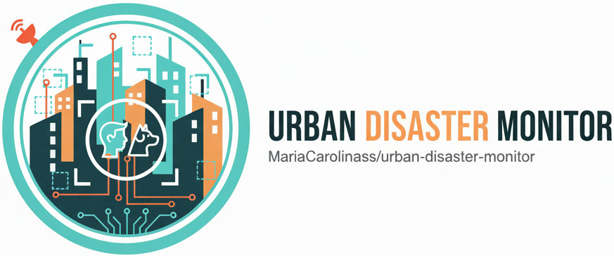

[](https://docs.ultralytics.com/pt/models/yolov8/#yolov8-usage-examples) [](https://github.com/MariaCarolinass/urban-disaster-monitor/blob/main/LICENSE.txt)

[Dataset](./dataset) | [Resultados](./static/results) | [Roboflow](https://universe.roboflow.com/ufrnprojects-xlut9/urban-disaster-monitor) | [App](https://huggingface.co/spaces/carolinasoares/urban_disaster_monitor)

Português | [English](./README-en.md)

</div>

# Urban Disaster Monitor: Detecção e Classificação de Pessoas em Cenários de Desastre

Sistema inteligente de visão computacional para **detecção e classificação de civis, animais e socorristas** em cenários de desastre urbano, utilizando **YOLOv11**.

<div align="center">

 
 
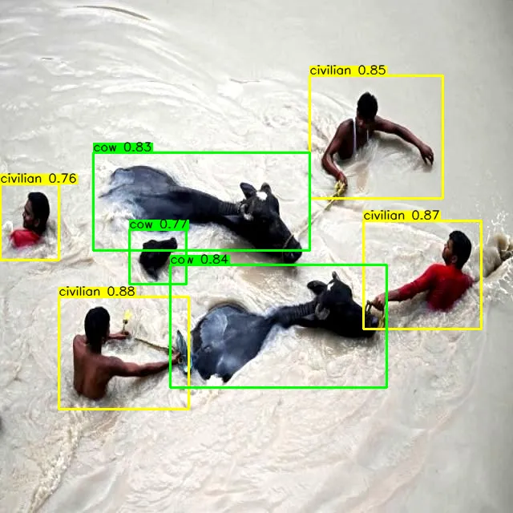 

</div>

---

🛑 Em situações de desastre urbano, cada segundo importa. Este projeto oferece uma ferramenta de visão computacional para ajudar equipes de resgate a agir com mais precisão e velocidade.

---

## Sumário


- [Estrutura de Pastas](#estrutura-de-pastas)
- [Funcionalidades](#funcionalidades)
- [Sobre](#sobre)
- [Detalhes do Dataset](#detalhes-do-dataset)
  - [Divisão do Dataset](#divisão-do-dataset)
  - [Pré-processamento e Augmentations](#pré-processamento-e-augmentations)
  - [Aquisição de Dados](#aquisição-de-dados)
    - [Imagens públicas](#imagens-públicas)
    - [Gemini 2.5 Flash Image (Nano Banana)](#gemini-25-flash-image-nano-banana)
      - [Prompts](#prompts)
      - [Como Gerar as Imagens](#como-gerar-as-imagens)
        - [Exemplo de Código para Geração de Imagens](#exemplo-de-código-para-gera%C3%A7%C3%A3o-de-imagens)
- [Anotação de Imagens](#anotação-de-imagens)
- [Arquitetura do Modelo e Ferramentas](#arquitetura-do-modelo-e-ferramentas)
  - [Treinamento e Otimização do Modelo](#treinamento-e-otimização-do-modelo)
- [Análise de Resultados e Métricas](#análise-de-resultados-e-métricas)
  - [Gráficos e Visualizações](#gráficos-e-visualizações)
    - [YOLO11N (modelo Nano)](#yolo11n-modelo-nano)
    - [YOLO11S (modelo Small)](#yolo11s-modelo-small)
    - [YOLO11M (modelo Medium)](#yolo11m-modelo-medium)
    - [YOLO11L (modelo Large)](#yolo11l-modelo-large)
- [Teste do Modelo em Vídeo](#teste-do-modelo-em-vídeo)
- [Conclusões](#conclusões)
  - [Recomendações Gerais para os Modelos](#recomendações-gerais-para-os-modelos)
    - [Comparativo dos Modelos Treinados](#comparativo-dos-modelos-treinados)
  - [Trabalhos Futuros](#trabalhos-futuros)
- [Interface Interativa](#interface-interativa)
  - [Funcionalidades da Interface](#funcionalidades-da-interface)
  - [Tecnologias Utilizadas](#tecnologias-utilizadas)
  - [Como Executar](#como-executar)
- [Equipe](#equipe)
- [Licença](#licença)
- [Referências Bibliográficas](#referências-bibliográficas)

## Estrutura de Pastas

```
urban-disaster-monitor/
├── app/
│   ├── examples/
│   ├── app.py
│   ├── requirements.txt
│   ├── README.md
│   └── train.py
├── dataset/
│   ├── test/
│   ├── train/
│   ├── val/
│   ├── data.yaml
│   ├── README.dataset.txt
│   └── README.roboflow.txt
├── models/
│   ├── yolov11l.pt
|   ├── yolov11m.pt
|   ├── yolov11n.pt
|   └── yolov11s.pt
├── static/
│   ├── gif/
│   ├── images/
│   ├── results/
│   │   ├── yolov11l/
│   │   ├── yolov11m/
│   │   ├── yolov11n/
|   │   └── yolov11s/
│   └── video/
├── README.md
└── LICENSE
```

## Funcionalidades

- Detecção e classificação de **Civis**, **Socorristas**, **Vacas**, **Cavalos**, **Cachorros** e **Gatos**
- Treinamento com **YOLOv11** em quatro versões: `n` (nano), `s` (small) `m` (medium) e `l` (large)
- Visualização de **métricas** e **bounding boxes**
- Interface interativa via **Gradio** para upload e teste de imagens e vídeos

## Sobre

Eventos de **desastre urbano**, como colapsos estruturais, inundações e deslizamentos de terra, impõem desafios significativos às operações de resposta e resgate. A capacidade de **identificar e categorizar rapidamente** indivíduos como civis ou socorristas em tempo real é crucial para a otimização da alocação de recursos e a minimização de fatalidades. Imagens coletadas por veículos aéreos não tripulados (VANTs), sistemas de vigilância e dispositivos móveis representam uma fonte de dados valiosa para esta finalidade.

O Urban Disaster Monitor é um **sistema inteligente de visão computacional** para a **detecção e classificação discriminativa de indivíduos (Civis e Socorristas)** e **animais (Vacas, Cavalos, Cachorros e Gatos)** em ambientes impactados por desastres urbanos. Utilizando a arquitetura de **detecção de objetos YOLOv11 (You Only Look Once, versão 11)**, o objetivo é construir uma ferramenta robusta e eficiente capaz de fornecer suporte crítico a autoridades e equipes de emergência durante a fase de resposta a desastres.

O desenvolvimento deste trabalho foi iniciado durante a disciplina de Visão Computacional ministrada pelo **Prof. Dr. [Helton Maia](https://heltonmaia.com/)** na **Escola de Ciências e Tecnologia (ECT/UFRN)**. O projeto é desenvolvido voluntariamente para o **Smart Metropolis** do **Instituto Metrópole Digital (IMD/UFRN)** como parte do **Projeto SPICI (Segurança Pública Integrada em Cidades Inteligentes)**. 

O SPICI visa criar uma plataforma inteligente para coleta, processamento e análise de imagens e informações críticas em tempo real, contribuindo para a gestão de crises e desastres por meio de tecnologias avançadas como visão computacional e inteligência artificial. O `Urban Disaster Monitor` alinha-se diretamente com os objetivos do SPICI ao fornecer uma ferramenta especializada para a identificação de pessoas em cenários de desastre, agregando valor à capacidade de resposta e tomada de decisão da plataforma.

<a href="https://smlab.imd.ufrn.br/"></a><a href="https://smlab.imd.ufrn.br/projeto-spici/"></a><a href="https://imd.ufrn.br/"></a><a href="https://www.ect.ufrn.br/"></a>

## Detalhes do Dataset

- **Total de imagens:** 3240
- **Classes:** 3.150 `civilian`, 1.074 `rescuer`, 531 `dog`, 637 `cat`, 811 `horse`, 749 `cow`
- **Anotado via:** [Roboflow](https://universe.roboflow.com/ufrnprojects-xlut9/urban-disaster-monitor/)
- **Formato das Anotações:** arquivos `.txt` contendo as coordenadas das _bounding boxes_ e os IDs das classes, acompanhados das imagens correspondentes, seguindo a convenção de nomenclatura do YOLO.
- **Fontes:** dados reais mais imagens sintéticas
- **Licença:** CC BY 4.0

### Divisão do Dataset

- **Treinamento:** 83% (2674 imagens)
- **Validação:** 12% (383 imagens)
- **Teste:** 6% (183 imagens)

### Pré-processamento e Augmentations

As etapas de pré-processamento são cruciais para otimizar o desempenho do modelo e garantir sua generalização:

- **Auto-orientação:** Aplicada para garantir alinhamento consistente das imagens.
- **Redimensionamento:** Todas as imagens foram redimensionadas para 640x640 pixels (stretch)
- **Ajuste automático de contraste:** Utilizando stretching de contraste para melhorar a visibilidade dos detalhes.
- **Aumentos de dados (Augmentations):**
  - Saídas por exemplo de treino: 2 imagens geradas por amostra original.
  - Rotação: entre -15° e +15°
  - Shear: ±10° horizontal, ±10° vertical
  - Tons de cinza: aplicado em 15% das imagens
  - Saturação: entre -25% e +25%
  - Ruído: até 0,89% dos pixels
- **Particionamento:** O dataset foi dividido em conjuntos de treino (83%), validação (12%) e teste (6%), assegurando avaliação imparcial e robusta do modelo.

### Aquisição de Dados

Para o treinamento e validação do modelo, foi compilado um **dataset abrangente** composto por diversas imagens que representam cenários típicos de desastres urbanos (e.g., edifícios colapsados, áreas inundadas). 

As fontes incluem **repositórios públicos de imagens de desastres** e a **geração de imagens sintéticas** para complementar a variabilidade do conjunto de dados. Essa abordagem híbrida visa mitigar a escassez de dados reais de alta qualidade em ambientes de desastre.

#### Imagens públicas

As imagens possuem licença aberta de uso e foram retiradas de sites:

- [Wikimedia Commons](https://commons.wikimedia.org/)
- [Flickr](https://www.flickr.com/)
- Google Images
- [Roboflow Universe](https://universe.roboflow.com/)

#### Gemini 2.5 Flash Image (Nano Banana)

Foi utilizada a ferramenta de geração de imagens **Gemini 2.5 Flash Image (Nano Banana)** para criar imagens sintéticas que simulam cenários de desastre urbano. A ferramenta permite a criação de imagens realistas com controle sobre diversos parâmetros, como iluminação, ângulo de visão e composição da cena.

No total foram 832 imagens geradas por Inteligência Artífical.

<div align="center">


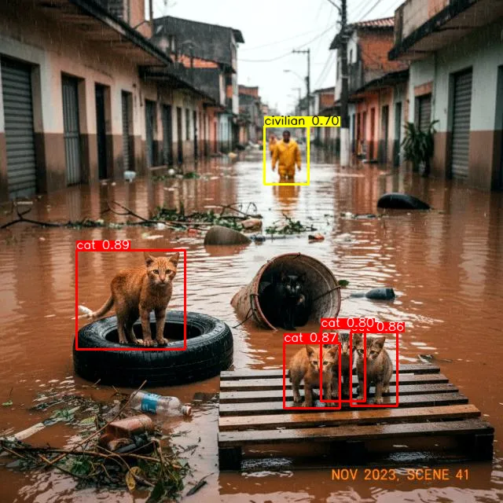

</div>

##### Prompts

Os prompts foram cuidadosamente elaborados para simular cenas realistas de desastres urbanos, especialmente enchentes, envolvendo animais como cavalos, vacas, cachorros e gatos. Eles seguem um padrão de foto documental ou fotojornalismo, enfatizando:

- **Cenários autênticos de desastre:** ruas alagadas, campos inundados, casas submersas, animais em situações de resgate ou isolamento.
- **Diversidade de espécies:** cavalos, vacas, cachorros e gatos em diferentes contextos de inundação.
- **Variação de qualidade e resolução:** prompts incluem desde imagens de baixa resolução até fotos mais nítidas, simulando registros reais de campo.
- **Detalhes visuais:** proporções realistas dos animais, expressões visíveis, corpos inteiros ou parcialmente submersos, presença de detritos, céu nublado, iluminação natural.
- **Situações variadas:** animais sozinhos, em grupos, sendo resgatados, presos em telhados, varandas, cercas ou objetos flutuantes.
- **Ambientes urbanos e rurais:** desde ruas e casas até pastos e fazendas, refletindo a diversidade de cenários afetados por enchentes.

Esses prompts garantem a criação de imagens sintéticas fiéis à realidade, enriquecendo o dataset com exemplos variados e desafiadores para o treinamento do modelo de detecção.

**Exemplo de prompts utilizados:**

```
"Authentic documentary photo of a brown horse standing in a flooded street after heavy rain, realistic proportions, clear body visible, imperfect disaster photo",
"Documentary style photo of a white horse trapped in a pasture with floodwater, overcast sky, realistic proportions, authentic disaster scene",
"Low-resolution documentary photo of two wet cats stranded on a rooftop surrounded by floodwater, realistic proportions, visible faces, authentic urban flood event",
"Documentary photo of a kitten on a balcony during flood, water rising near railing, cloudy weather, clear body visible, authentic disaster photo",
"Photojournalism style disaster photo of a German shepherd swimming in a flooded street, cars partially submerged, realistic proportions, natural lighting",
"Low quality documentary style photo of a stray dog on a small wooden raft during flood, rescue scene, realistic body intact",
"Documentary flood photo of cows standing in a partially submerged field, water up to their legs, cloudy sky, authentic proportions",
"Realistic low-resolution documentary photo of a cow isolated in floodwater reflecting sunset colors, authentic disaster photo"
"Photojournalism style disaster photo of a German shepherd swimming in a flooded street, cars partially submerged, realistic proportions, natural lighting"
```

##### Como Gerar as Imagens

1. Acesse a ferramenta [Gemini 2.5 Flash Image (Nano Banana)](https://ai.google.com/research/gemini).
2. Insira os prompts na seção de geração de imagens.
3. Ajuste os parâmetros conforme necessário (resolução, estilo, etc.).
4. Gere as imagens e faça o download para inclusão no dataset.

Para geração de imagens em lote, utilize scripts ou ferramentas de automação que suportem a API da Gemini, se disponível.

###### Exemplo de Código para Geração de Imagens

Instale as bibliotecas necessárias:

```bash
pip install google-generativeai pillow
```

Crie uma conta e obtenha a chave da API em [Google Cloud Console](https://console.cloud.google.com/).

Use o seguinte código para gerar imagens:

```python
import os
import google.generativeai as genai
from google.generativeai import types
from PIL import Image
from io import BytesIO
import time

genai.configure(api_key="GOOGLE_API_KEY")

OUTPUT_DIR = "imagens_geradas"
os.makedirs(OUTPUT_DIR, exist_ok=True)

prompts = [
    "Realistic low-resolution documentary photo of a cow isolated in floodwater reflecting sunset colors, authentic disaster photo",
    "Documentary style photo of a white horse trapped in a pasture with floodwater, overcast sky, realistic proportions, authentic disaster scene",
    "Low-resolution documentary photo of two wet cats stranded on a rooftop surrounded by floodwater, realistic proportions, visible faces, authentic urban flood event"
]

def generate_and_save_image(prompt, index):
    print(f"[{index}/{len(prompts)}] Gerando imagem para o prompt: '{prompt[:70]}...'")

    try:
        response = genai.GenerativeModel(model_name="gemini-2.5-flash-image-preview").generate_content(
            contents=[prompt]
        )

        image_data = None
        for part in response.candidates[0].content.parts:
            if part.inline_data:
                image_data = part.inline_data.data
                break

        if image_data:
            image = Image.open(BytesIO(image_data))
            filename = os.path.join(OUTPUT_DIR, f"image_{index}.png")
            image.save(filename)
            print(f"Imagem salva com sucesso: {filename}")
        else:
            print(f"FALHA: Nenhuma imagem encontrada na resposta para o prompt {index}.")
            for part in response.candidates[0].content.parts:
                if part.text:
                    print(f"Mensagem do modelo: {part.text[:100]}")

    except Exception as e:
        print(f"ERRO: Ocorreu um erro na chamada da API para o prompt {index}: {e}")

for i, prompt in enumerate(prompts):
    index = i + 1

    generate_and_save_image(prompt, index)
    time.sleep(0.5)

print("Geração de imagens concluída.")
print(f"Todas as imagens geradas foram salvas na pasta: {OUTPUT_DIR}")
```

## Anotação de Imagens

A **anotação dos objetos de interesse** está sendo realizada na plataforma **Roboflow**, onde as classes primárias de interesse são definidas como:

- `civilian`: indivíduos não identificados como membros de equipes de resgate.
- `rescuer`: indivíduos equipados ou identificáveis como parte de equipes de emergência (e.g., bombeiros, paramédicos), frequentemente distinguíveis por uniformes, equipamentos de proteção individual (EPI) ou posturas operacionais.
- `cat`: animais domésticos presentes em cenários urbanos que podem demandar resgate ou indicar áreas residenciais.
- `dog`: animais domésticos, relevantes em contextos de busca e salvamento ou áreas habitadas.
- `cow`: animais de grande porte que podem ser encontrados em regiões urbanas periféricas ou rurais afetadas por desastres.
- `horse`: animais usados no apoio ao resgate ou encontrados em áreas de risco, igualmente incluídos pela sua relevância logística.

## Arquitetura do Modelo e Ferramentas

- **Modelo de Detecção:** **Ultralytics YOLOv11 (You Only Look Once, versão 11)**. Essa arquitetura foi selecionada por sua comprovada eficiência na detecção de objetos em tempo real, combinando alta acurácia com velocidade de inferência, características essenciais para aplicações em cenários emergenciais.
- **Arquitetura:** YOLOv11 em quatro versões: `YOLOv11n`, `YOLOv11s`, `YOLOv11m` e `YOLOv11l`
- **Treinamento:** 50 épocas comparadas
- **Tarefa:** Detecção de Objetos (Object Detection).

### Treinamento e Otimização do Modelo

O processo de treinamento envolve as seguintes fases, visando a otimização do desempenho do modelo:

1. **Conversão de Anotações:** As anotações geradas no formato Roboflow são convertidas para o formato YOLO (`.txt`), que é o padrão de entrada para os modelos da família YOLO.
2. **Treinamento Iterativo:** O modelo é treinado utilizando um conjunto de parâmetros otimizados, incluindo _batch size_, taxa de aprendizado (_learning rate_) e número de _epochs_. Técnicas de agendamento da taxa de aprendizado (_learning rate schedulers_) e otimizadores (e.g., Adam, SGD) são empregadas para acelerar a convergência e melhorar a performance.
3. **Validação Contínua:** O desempenho do modelo é monitorado e validado em tempo real durante o treinamento utilizando métricas de desempenho padrão da área em um conjunto de validação separado. Isso permite identificar _overfitting_ e ajustar hiperparâmetros de forma dinâmica.
4. **Testes e Avaliação:** Após o treinamento, o modelo é avaliado extensivamente em um conjunto de teste independente, contendo imagens reais e cenários não vistos, para verificar sua capacidade de generalização e robustez em condições adversas.

Durante o treinamento é realizado **validações periódicas** para **monitorar o desempenho do modelo** e **ajustar hiperparâmetros conforme necessário**. A avaliação final é conduzida em um conjunto de teste independente, garantindo que o modelo seja capaz de generalizar para novos dados e cenários.

As imagens a seguir ilustram o **processo de treinamento e validação do modelo YOLOv11 versão Medium (YOLOv11m)**.

- Primeiro é mostrado o resultado da predição do modelo em uma imagem de validação:

<div align="center">
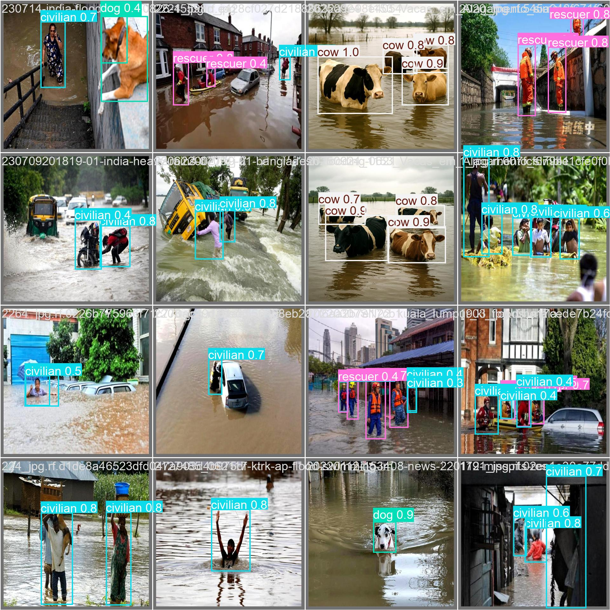
</div>

- Seguido pela imagem original com as anotações corretas (labels):

<div align="center">
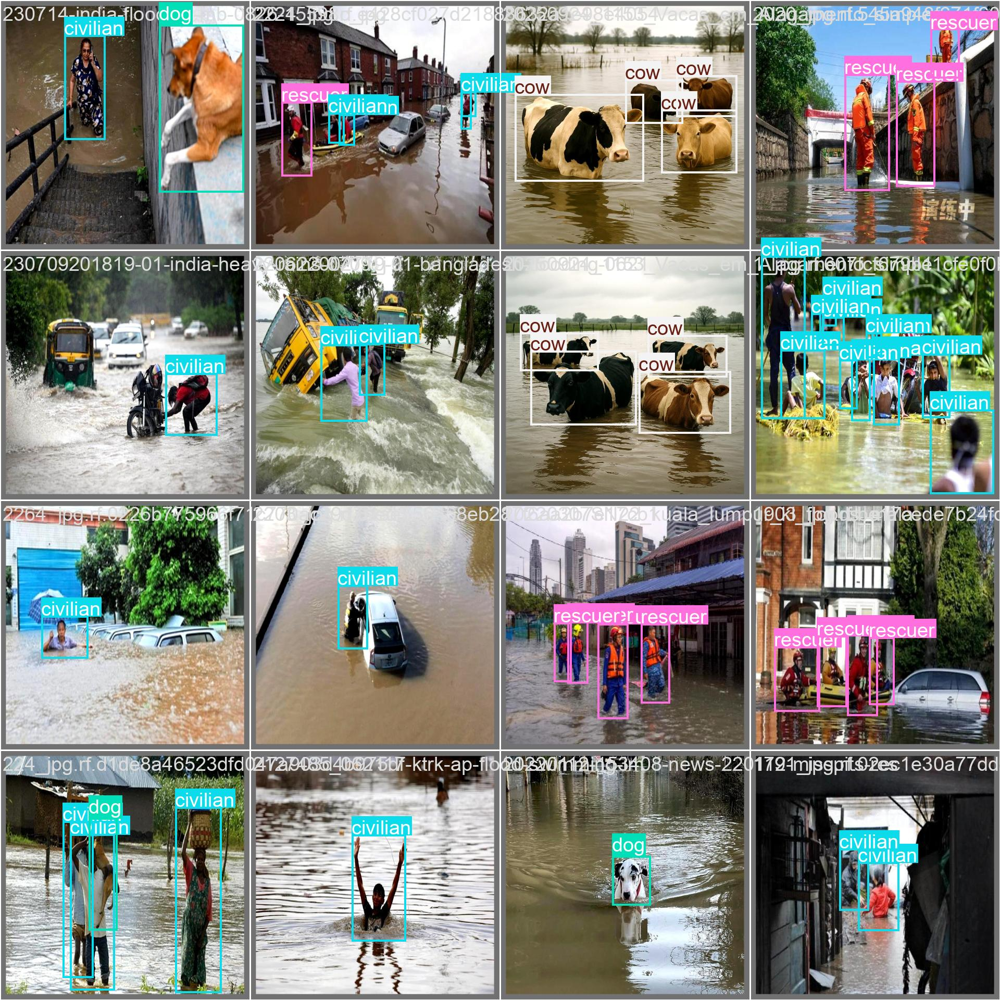
</div>

Durante o treinamento, são gerados gráficos que mostram a evolução da perda (_loss_) ao longo das épocas e métricas de desempenho como precisão (_precision_), revocação (_recall_) e _mAP_ (mean Average Precision), permitindo uma análise detalhada do aprendizado do modelo.

### Análise de Resultados e Métricas

A avaliação da eficácia do modelo foi realizada através de um conjunto de métricas quantitativas e qualitativas, fornecendo uma análise abrangente do seu desempenho:

- **Métricas de Precisão Média (mAP)**:
  - **mAP@0.5**: _Mean Average Precision_ calculada com um _IoU (Intersection over Union)_ _threshold_ de 0.5. Essa métrica é comumente utilizada para avaliação rápida da precisão de detecção.
  - **mAP@0.5:0.95**: _Mean Average Precision_ calculada em múltiplos _thresholds_ de _IoU_, variando de 0.5 a 0.95 em etapas de 0.05. Essa métrica oferece uma medida mais robusta e abrangente da acurácia de localização e classificação das detecções.
- **Precisão (Precision) e Recall (Revocação)**: Avaliados por classe para compreender o desempenho individual na identificação de civis e socorristas, indicando a proporção de detecções corretas e a capacidade do modelo de encontrar todas as instâncias relevantes, respectivamente.
- **Matriz de Confusão (Confusion Matrix)**: Essencial para visualizar e analisar os tipos de erros (falsos positivos, falsos negativos) cometidos pelo modelo, especialmente a confusão entre as classes de interesse, o que é crítico em cenários onde a distinção entre civis e socorristas é vital.
- **Análise Qualitativa**: Serão apresentadas visualizações das _bounding boxes_ e rótulos de classe sobre as imagens de teste. Essa análise visual permite uma avaliação subjetiva da acurácia das detecções e da capacidade do modelo de lidar com variações de escala, oclusão e iluminação.
- **Curvas de Confiança**: Avaliação detalhada das curvas de F1, Precision e Recall em função dos thresholds de confiança, permitindo identificar o ponto ótimo de operação do modelo para balancear precisão e sensibilidade.
- **Identificação de Gargalos**: Através da análise dos falsos positivos e falsos negativos, destacam-se as classes com maior confusão, especialmente entre "civilian" e "background", bem como desafios na detecção de animais menores como "dog" e "cat".

Essa análise abrangente foi fundamental para orientar melhorias futuras no pipeline, visando maior robustez e confiabilidade do sistema em aplicações reais no monitoramento de desastres urbanos.

#### Gráficos e Visualizações

##### YOLOv11N (modelo Nano):

Gráficos gerados durante o treinamento e avaliação do modelo YOLOv11N:

<div align="center">
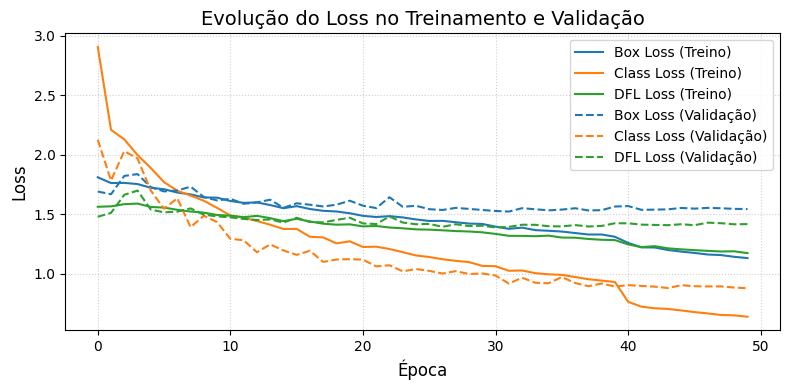 
</div>

O gráfico acima mostra a evolução da perda (_loss_) ao longo das 50 épocas de treinamento, indicando a convergência do modelo.

<div align="center"> 
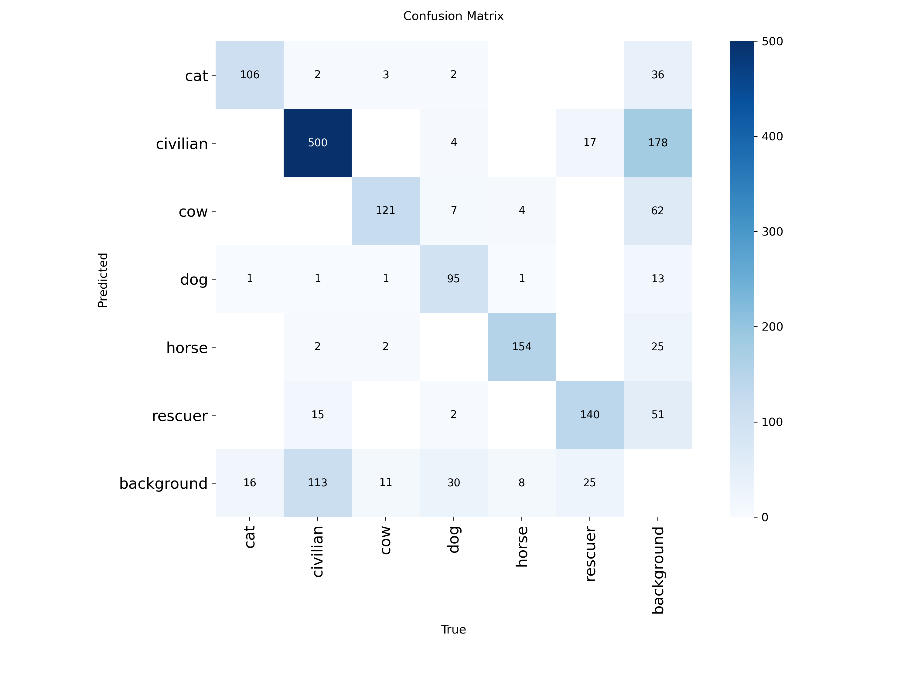 
</div>

O gráfico da matriz de confusão acima ilustra a performance do modelo na classificação das diferentes classes, destacando acertos e erros.

<div align="center"> 
 
</div>

O gráfico acima apresenta as métricas de precisão (_precision_), revocação (_recall_) e _mAP_ (mean Average Precision) ao longo das épocas, evidenciando a melhoria contínua do modelo.

##### YOLOv11S (modelo Small)

Gráficos gerados durante o treinamento e avaliação do modelo YOLOv11S:

<div align="center"> 
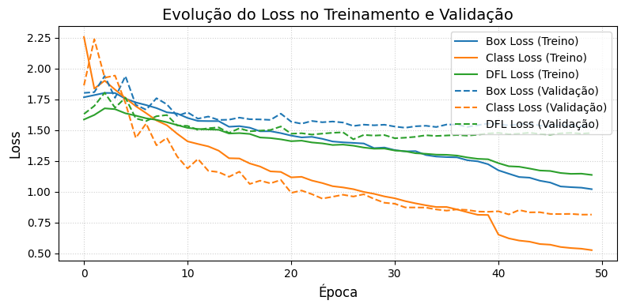 
</div>

O gráfico acima mostra a evolução da perda (_loss_) ao longo das 50 épocas de treinamento, indicando a convergência do modelo.

<div align="center"> 
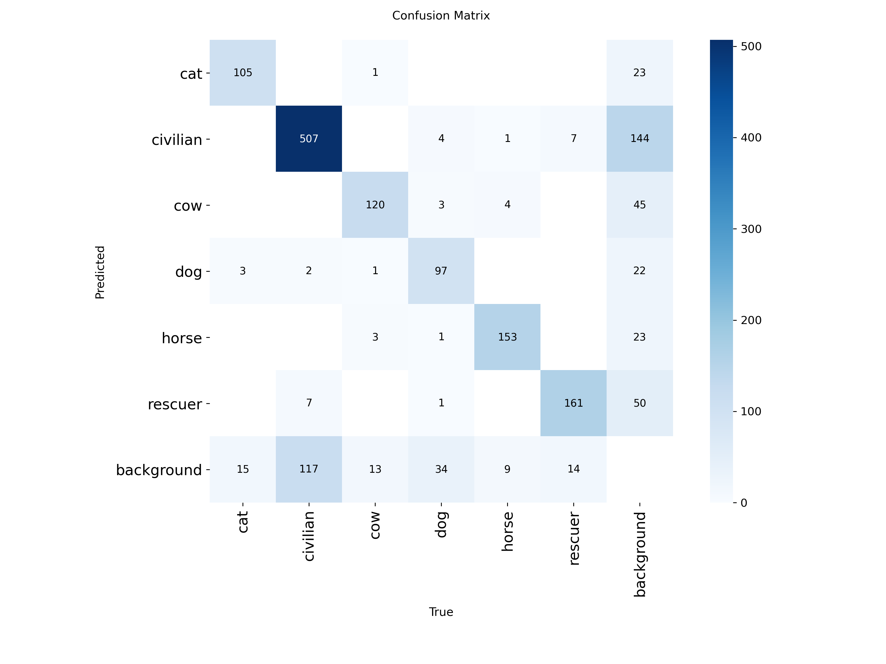 
</div>

O gráfico da matriz de confusão acima ilustra a performance do modelo na classificação das diferentes classes, destacando acertos e erros.

<div align="center"> 
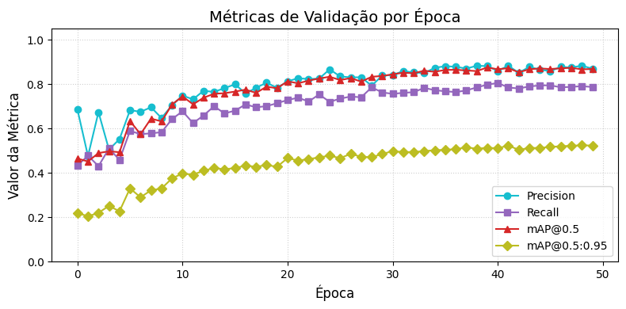 
</div>

O gráfico acima apresenta as métricas de precisão (_precision_), revocação (_recall_) e _mAP_ (mean Average Precision) ao longo das épocas, evidenciando a melhoria contínua do modelo.

##### YOLOv11M (modelo Medium):

Gráficos gerados durante o treinamento e avaliação do modelo YOLOv11M:

<div align="center"> 
 
</div>

O gráfico acima mostra a evolução da perda (_loss_) ao longo das 50 épocas de treinamento, indicando a convergência do modelo.

<div align="center"> 
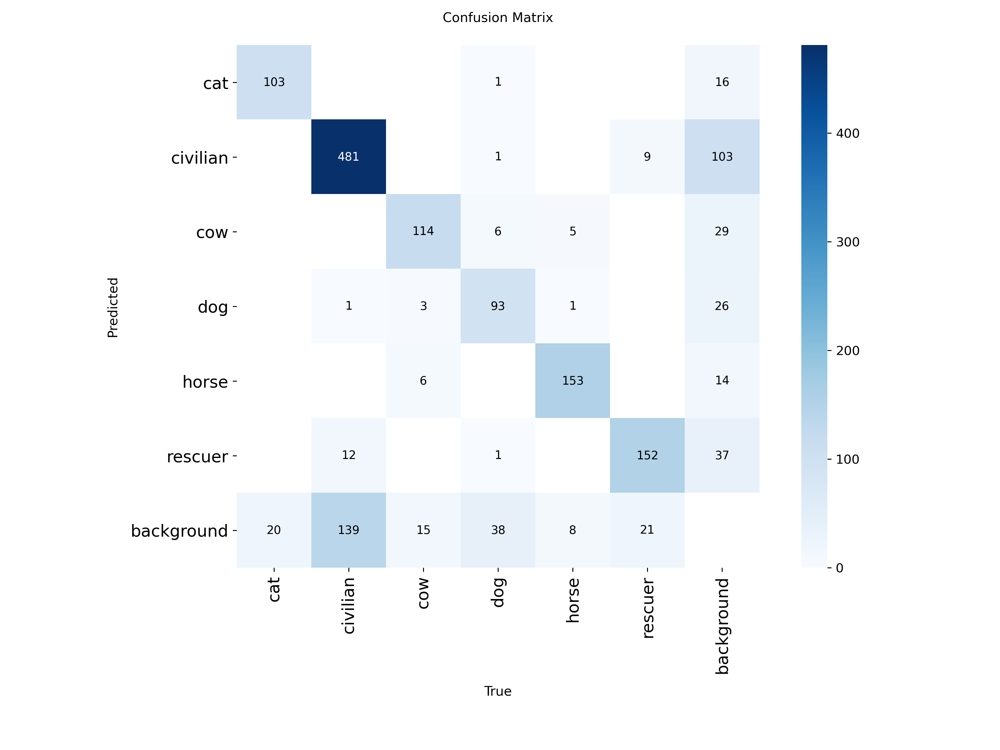 
</div>

O gráfico da matriz de confusão acima ilustra a performance do modelo na classificação das diferentes classes, destacando acertos e erros.

<div align="center"> 
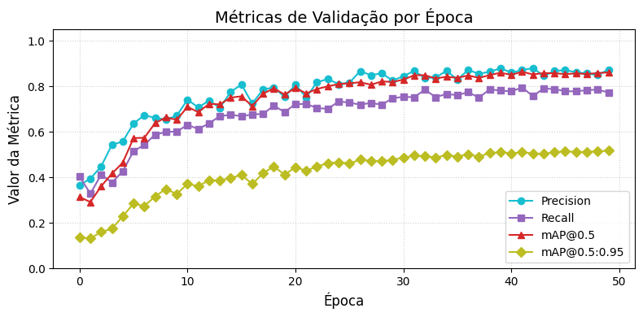 
</div>

O gráfico acima apresenta as métricas de precisão (_precision_), revocação (_recall_) e _mAP_ (mean Average Precision) ao longo das épocas, evidenciando a melhoria contínua do modelo.

##### YOLOv11L (modelo Large):

Gráficos gerados durante o treinamento e avaliação do modelo YOLOv11L:

<div align="center"> 
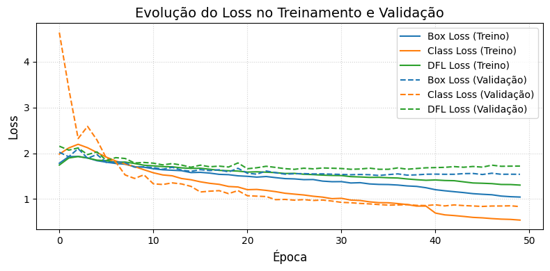 
</div>

O gráfico acima mostra a evolução da perda (_loss_) ao longo das 50 épocas de treinamento, indicando a convergência do modelo.

<div align="center"> 
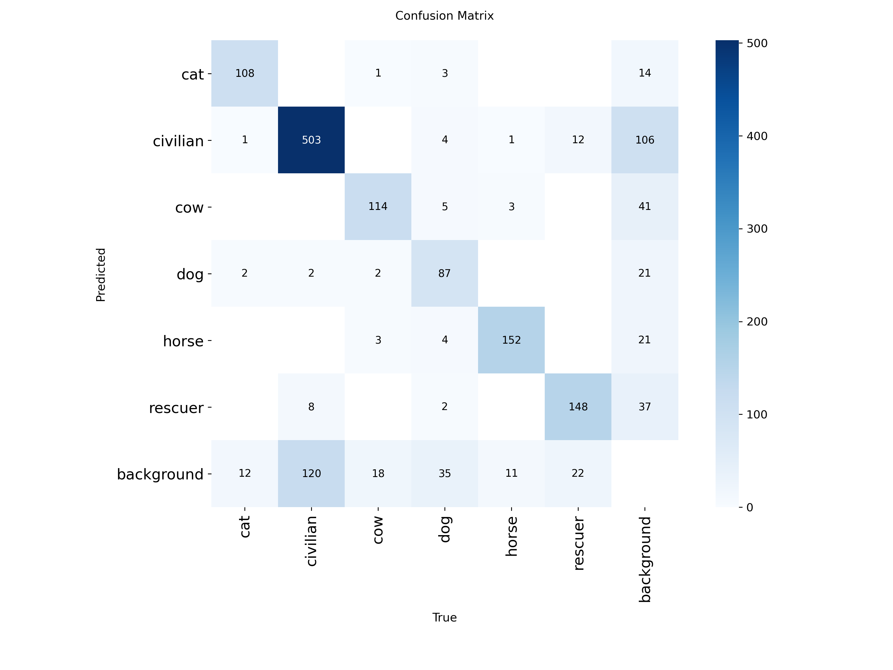 
</div>

O gráfico da matriz de confusão acima ilustra a performance do modelo na classificação das diferentes classes, destacando acertos e erros.

<div align="center"> 
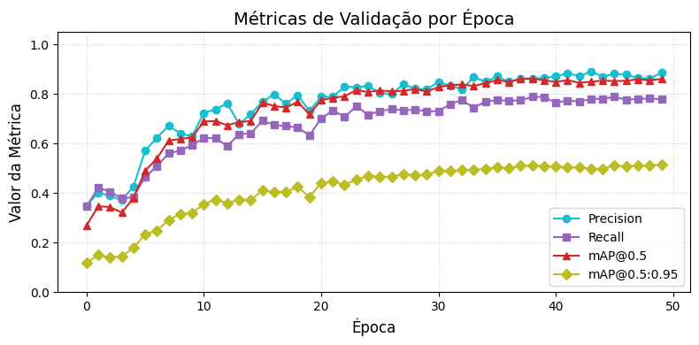 
</div>

O gráfico acima apresenta as métricas de precisão (_precision_), revocação (_recall_) e _mAP_ (mean Average Precision) ao longo das épocas, evidenciando a melhoria contínua do modelo.

## Teste do Modelo em Vídeo

Um [vídeo público do YouTube](https://www.youtube.com/watch?v=QnFwDqzCwRU) foi utilizado para simular um cenário real de desastre urbano:

<div align="center">


</div>

O vídeo apresenta cenas de bombeiros `rescuer` em áreas de inundação afetadas por desastres, com a presença de um animal (uma cabra) não identificado, pois o modelo não foi treinado para reconhecer essa classe. 

O modelo treinado com o **Yolov11 versão Medium** foi aplicado ao vídeo considerando uma **confiança de no mínimo 0.75** para avaliar sua capacidade de detectar e classificar corretamente os indivíduos em movimento, sob diferentes condições de iluminação e ângulos de câmera.

O desempenho do modelo foi satisfatório, com a maioria dos `rescuers` sendo corretamente identificados, demonstrando a eficácia do Urban Disaster Monitor em cenários dinâmicos. No entanto, o modelo ainda indicou alguns falsos negativos, como a predição incorreta de um objeto como `dog` com confiança de até 0.8, evidenciando a necessidade de aprimoramento contínuo, especialmente na diversificação do dataset e no refinamento dos hiperparâmetros para melhorar a robustez em vídeos. 

Em alguns momentos, o modelo não conseguiu detectar todos os `rescuers`, possivelmente devido a oclusões parciais ou ângulos desfavoráveis.

## Conclusões

- O modelo **YOLOv11n** oferece boa performance com menor custo computacional, sendo adequado para cenários com restrição operacional, como drones e edge devices.
- O modelo **YOLOv11s** demonstra melhoria significativa em relação ao modelo **YOLOv11n**, sobretudo em estabilização do aprendizado e aumento do F1 score (0.83). Mantém ainda tempos de inferência compatíveis para aplicações em tempo real em campo, como drones e câmeras inteligentes.
- Entre os modelos, **YOLOv11m** se destacou por métricas superiores e melhor generalização, indicado para aplicações críticas que demandam alta precisão.
- A análise reforça a importância de técnicas complementares como augmentations, balanceamento de dados e modelagem temporal para aprimorar ainda mais a robustez do Urban Disaster Monitor.
- O uso de infraestrutura dedicada com GPU avançada (Google Colab Pro, NVIDIA A100) é recomendado para permitir treinamentos estendidos e experimentos mais complexos.
  Essas diretrizes fundamentam o desenvolvimento contínuo do projeto, buscando impactar positivamente na capacidade de resposta rápida, segura e eficiente em situações emergenciais urbanas.

### Recomendações Gerais para os Modelos

- **YOLO11s:** Ideal para aplicações que necessitam de mais precisão que a variante Nano, mas que operam em ambientes com restrições moderadas de hardware, como drones e câmeras urbanas inteligentes.
- **YOLO11m:** Modelo indicado para ambientes de produção, com uma boa combinação de performance e custo computacional.
- **YOLO11l:** Para cenários que demandam a máxima precisão, compatível com ambientes que dispõem de infraestrutura robusta.
- **YOLO11n:** Perfeito para dispositivos com limitações extremas, onde rapidez e eficiência energética são prioridades.

#### Comparativo dos Modelos Treinados

| Modelo    | mAP@0.5:0.95 | Parâmetros (M) | FLOPs (B) | Tempo Inferência CPU (ms) | Tempo Inferência GPU (TensorRT, ms) | Uso Recomendado                   |
|-----------|--------------|---------------|-----------|--------------------------|------------------------------------|----------------------------------|
| YOLOv11n  | ~39.5%       | 2.6           | 6.5       | 56.1                     | 1.5                                | Dispositivos de borda (edge)      |
| YOLOv11s  | ~47.0%       | 9.4           | 21.5      | 90.0                     | 2.5                                | Drones, câmeras inteligentes      |
| YOLOv11m  | ~51.5%       | 20.1          | 68.0      | 183.2                    | 4.7                                | Produção equilibrada              |
| YOLOv11l  | ~53.4%       | 25.3          | 86.9      | 238.6                    | 6.2                                | Máxima precisão (alto custo)     |

### Trabalhos Futuros

- Identificação e classificação avançada de animais em cenários de resgate, incluindo diferentes espécies e estados.
- Integração com dados temporais, utilizando arquiteturas como ConvLSTM e Transformers, para melhorar o acompanhamento de movimentações e a estabilidade das detecções em vídeos.
- Implementação e otimização em sistemas embarcados, como drones e câmeras urbanas, para permitir detecção eficiente e em tempo real no ambiente.
- Expansão da detecção para objetos contextuais relevantes, como destroços, veículos de resgate, barreiras e outros elementos de cena que enriquecem a compreensão do cenário.
- Treinamento com conjuntos de dados mais diversos, incluindo situações noturnas e condições adversas (baixa visibilidade, fumaça, chuva) para aumentar a robustez do modelo.
- Experimentação com aumento do número de épocas de treinamento em ambientes dedicados de alta capacidade computacional para maximizar a convergência e desempenho.
- Refinamento dos hiperparâmetros para aplicações específicas, especialmente em vídeos, visando melhor equilíbrio entre ruído e consistência temporal.
- Desenvolvimento de pipelines para aprendizado contínuo e adaptação dinâmica a novos cenários e classes emergentes.

## Interface Interativa

Uma interface interativa foi desenvolvida utilizando a biblioteca **Gradio** para facilitar o uso do modelo treinado. A interface permite o upload de imagens e vídeos para detecção em tempo real, exibindo os resultados com as _bounding boxes_ e rótulos de classe.

### 👉 [Teste a Interface](https://huggingface.co/spaces/carolinasoares/urban-disaster-monitor-v2)

<div align="center">

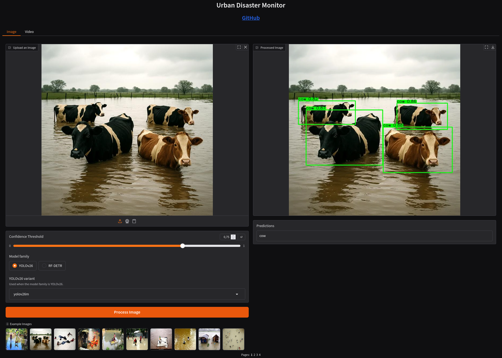

</div>

Hospedado com **[Hugging Face ](https://huggingface.co)**

### Funcionalidades da Interface

Na interface, o usuário pode:

- Selecionar o modelo desejado (YOLOv11n, YOLOv11s, YOLOv11m, YOLOv11l).
- Fazer upload de imagens ou vídeos.
- Ajustar o nível de confiança (_confidence threshold_) para as detecções.
- Visualizar os resultados com as detecções destacadas.
- Baixar as imagens ou vídeos processados com as detecções.

### Tecnologias Utilizadas

- [Python](https://www.python.org/)
- [Gradio](https://gradio.app/)
- [Ultralytics YOLO](https://docs.ultralytics.com)
- [PyTorch](https://pytorch.org/)
- [OpenCV](https://opencv.org/)
- [NumPy](https://numpy.org/)

### Como Executar

Baixe o repositório:

```bash
git clone https://github.com/MariaCarolinass/urban-disaster-monitor.git
```

Acesse a pasta `app`:

```bash
cd urban-disaster-monitor/app
```

Crie o ambiente virtual venv:

```bash
python3 -m venv venv
```

Ative o ambiente virtual venv:

```bash
source venv/bin/activate
```

Instale as bibliotecas:

```bash
pip install -r requirements.txt
```

Execute o projeto:

```bash
python app.py
```

## Equipe

| [](https://github.com/jagaldino) | [](https://github.com/MariaCarolinass) |
| :---------------------------------------------------------------------------: | :-----------------------------------------------------------------------------: |
|                           **João Galdino** Desenvolvedor                           |                             **Carolina Soares** Desenvolvedora                | 

## Licença

Projeto licenciado sob [MIT License](./LICENSE.txt).

---

## Referências Bibliográficas

- Projeto SPICI (Smart Platform for Images and Critical Information). Disponível em: [https://smlab.imd.ufrn.br/spici/](https://smlab.imd.ufrn.br/spici/)
- Ultralytics. **YOLOv8 Documentation**. Disponível em: [https://docs.ultralytics.com](https://docs.ultralytics.com)
- Roboflow. Disponível em: [https://roboflow.com](https://roboflow.com)
- Redmon, J.; Farhadi, A. (2018). **YOLOv3: An Incremental Improvement**. _arXiv preprint arXiv:1804.02767_. Disponível em: [https://arxiv.org/abs/1804.02767](https://arxiv.org/abs/1804.02767)
- Redmon, J.; Divvala, S.; Girshick, R.; Farhadi, A. (2016). **You Only Look Once: Unified, Real-Time Object Detection**. In: _Proceedings of the IEEE Conference on Computer Vision and Pattern Recognition (CVPR)_, pp. 779-788. Disponível em: [https://arxiv.org/abs/1506.02640](https://arxiv.org/abs/1506.02640)
