<div align="center">

# Urban Disaster Monitor


[](https://docs.ultralytics.com/pt/models/yolov8/#yolov8-usage-examples) [](https://github.com/MariaCarolinass/urban-disaster-monitor/blob/main/LICENSE.txt)

[App](https://huggingface.co/spaces/carolinasoares/urban_disaster_monitor) | [Dataset](https://github.com/MariaCarolinass/urban-disaster-monitor/tree/main/dataset)

[English](./README.md) | [Português](./README.pt.md)

</div>

# Urban Disaster Monitor: Detecção e Classificação de Pessoas em Cenários de Desastre

Sistema inteligente de visão computacional para **detecção e classificação de civis e socorristas** em cenários de desastre urbano, utilizando **YOLOv11**.

<div align="center">

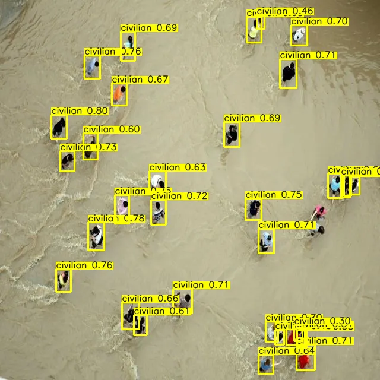 
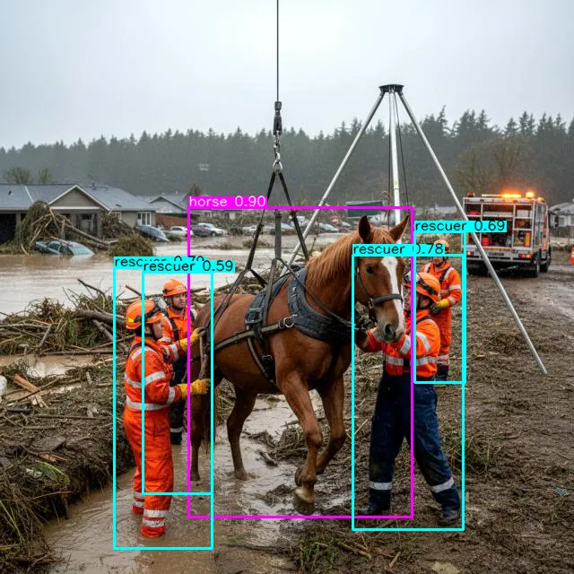

</div>

---

🛑 Em situações de desastre urbano, cada segundo importa. Este projeto oferece uma ferramenta de visão computacional para ajudar equipes de resgate a agir com mais precisão e velocidade.

---

## 📑 Sumário

- [Estrutura do Projeto](#-estrutura-do-projeto)
- [Funcionalidades](#-funcionalidades)
- [Introdução](#-introdução)
- [Dataset](#-dataset)
- [Metodologia](#%EF%B8%8F-metodologia)
  - [Aquisição e Anotação de Dados](#aquisição-e-anotação-de-dados)
  - [Pré-processamento de Dados](#pré-processamento-de-dados)
  - [Arquitetura do Modelo e Ferramentas](#arquitetura-do-modelo-e-ferramentas)
  - [Treinamento e Otimização do Modelo](#treinamento-e-otimização-do-modelo)
- [Resultados e discussões](#-resultados-e-discussões)
  - [Análise de Resultados e Métricas](#análise-de-resultados-e-métricas)
  - [Avaliação em Imagens Estáticas](#avaliação-em-imagens-estáticas)
  - [Avaliação em Vídeo](#avaliação-em-vídeo)
  - [Gráficos e Visualizações](#gráficos-e-visualizações)
  - [Trabalhos Futuros](#trabalhos-futuros)
- [Conclusão](#-conclusão)
- [Interface Interativa](#-interface-interativa)
- [Tecnologias](#%EF%B8%8F-tecnologias)
- [Equipe do Projeto](#-equipe-do-projeto)
- [Como Executar](#-como-executar)
- [Licença](#-licença)
- [Referências Bibliográficas](#-referências-bibliográficas)

---

## 📁 Estrutura do Projeto

```
urban-disaster-monitor/
├── app/
│   ├── examples/
│   ├── models/
│   │   └── best30p.pt
|   |   └── best50p.pt
│   ├── app.py
│   ├── requirements.txt
│   ├── README.md
├── dataset/
│   ├── test/
│   ├── train/
│   ├── val/
│   ├── data.yaml/
│   └── README.md
├── notebooks/
│   │   └── urban_disaster_monitor.ipynb
├── static/
│   ├── images/
│   ├── graphics/
│   └── matrix/
│   └── gif/
├── config.py
├── train.py
├── README.md
└── LICENSE
```

---

## 🔍 Funcionalidades

- Detecção de pessoas em **imagens** e **vídeos**
- Diferenciação entre **civis** e **socorristas**
- Localização de **cachorro**, **gato**, **cavalo** e **vaca**
- Treinamento com **YOLOv11**
- Visualização de **métricas e bounding boxes**

---

## 📌 Introdução

Eventos de **desastre urbano**, como colapsos estruturais, inundações e deslizamentos de terra, impõem desafios significativos às operações de resposta e resgate. A capacidade de **identificar e categorizar rapidamente** indivíduos como civis ou socorristas em tempo real é crucial para a otimização da alocação de recursos e a minimização de fatalidades. Imagens coletadas por veículos aéreos não tripulados (VANTs), sistemas de vigilância e dispositivos móveis representam uma fonte de dados valiosa para esta finalidade.

Este projeto propõe o desenvolvimento de um **sistema inteligente de visão computacional** para a **detecção e classificação discriminativa de indivíduos (civis e socorristas)** em ambientes impactados por desastres urbanos. Utilizando a arquitetura de **detecção de objetos YOLOv11 (You Only Look Once, versão 11)**, o objetivo é construir uma ferramenta robusta e eficiente capaz de fornecer suporte crítico a autoridades e equipes de emergência durante a fase de resposta a desastres.

Desenvolvido durante a disciplina de Visão Computacional na **Escola de Ciências e Tecnologia (ECT/UFRN)** em trabalho voluntário para o **Smart Metropolis Lab (SMLab)** do **Instituto Metrópole Digital (IMD/UFRN)**, este trabalho é parte integrante do **Projeto SPICI (Segurança Pública Integrada em Cidades Inteligentes)**. O SPICI visa criar uma plataforma inteligente para coleta, processamento e análise de imagens e informações críticas em tempo real, contribuindo para a gestão de crises e desastres por meio de tecnologias avançadas como visão computacional e inteligência artificial. O `Urban Disaster Monitor` alinha-se diretamente com os objetivos do SPICI ao fornecer uma ferramenta especializada para a identificação de pessoas em cenários de desastre, agregando valor à capacidade de resposta e tomada de decisão da plataforma.

<div align="center">

<a href="https://smlab.imd.ufrn.br/">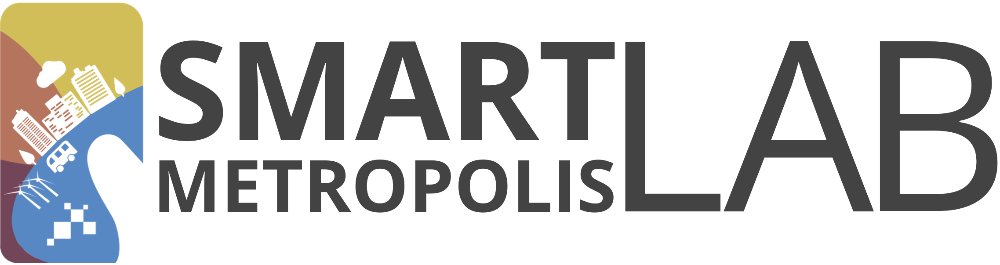</a><a href="https://smlab.imd.ufrn.br/projeto-spici/"></a><a href="https://imd.ufrn.br/"></a><a href="https://www.ect.ufrn.br/"></a>

</div>

---

## 📂 Dataset

- **Total de imagens**: 3240
- **Fontes**: dados reais mais imagens sintéticas
- **Classes**:
  - `people` (civis)
  - `rescuer` (socorristas com EPI)
  - `dog` (cachorro)
  - `cat` (gato)
  - `horse` (cavalo)
  - `cow` (vaca)
- **Anotado via**: [Roboflow](https://universe.roboflow.com/ufrnprojects-xlut9/urban-disaster-monitor/)
- **Formato das Anotações**: arquivos `.txt` contendo as coordenadas das _bounding boxes_ e os IDs das classes, acompanhados das imagens correspondentes, seguindo a convenção de nomenclatura do YOLO.

---

## ⚙️ Metodologia

- Arquitetura: `YOLOv11n` e `YOLOv11m`
- Aumento de dados: rotação, ruído, brilho, etc.
- Treinamento: 50 épocas comparadas
- Métricas principais:
  - `mAP@0.5`, `mAP@0.5:0.95`
  - `Precision`, `Recall`
  - `F1-Score máximo`
  - Matriz de confusão

### Aquisição e Anotação de Dados

Para o treinamento e validação do modelo, foi compilado um **dataset abrangente** composto por diversas imagens que representam cenários típicos de desastres urbanos (e.g., edifícios colapsados, áreas inundadas). As fontes incluem **repositórios públicos de imagens de desastres** e a **geração de imagens sintéticas** para complementar a variabilidade do conjunto de dados. Essa abordagem híbrida visa mitigar a escassez de dados reais de alta qualidade em ambientes de desastre.

A **anotação dos objetos de interesse** está sendo realizada na plataforma **Roboflow**, onde as classes primárias de interesse são definidas como:

- `People`: Indivíduos não identificados como membros de equipes de resgate.
- `Rescuer`: Indivíduos equipados ou identificáveis como parte de equipes de emergência (e.g., bombeiros, paramédicos), frequentemente distinguíveis por uniformes, equipamentos de proteção individual (EPI) ou posturas operacionais.
- `cat`: Animais domésticos presentes em cenários urbanos que podem demandar resgate ou indicar áreas residenciais.
- `dog`: Animais domésticos, relevantes em contextos de busca e salvamento ou áreas habitadas.
- `cow`: Animais de grande porte que podem ser encontrados em regiões urbanas periféricas ou rurais afetadas por desastres.
- `horse`: Animais usados no apoio ao resgate ou encontrados em áreas de risco, igualmente incluídos pela sua relevância logística.

### Pré-processamento de Dados

As etapas de pré-processamento são cruciais para otimizar o desempenho do modelo e garantir sua generalização:

- **Redimensionamento**: Todas as imagens são escaladas para dimensões compatíveis com as entradas da arquitetura YOLOv8, balanceando a fidelidade da informação visual com a eficiência computacional.
- **Aumento de Dados (Data Augmentation)**: Técnicas de aumento de dados (e.g., rotação, translação, espelhamento, ajuste de brilho e contraste, _blurring_ e ruído) são aplicadas para aumentar a robustez do modelo, mitigar o risco de _overfitting_ e compensar potenciais desequilíbrios entre as classes. A diversificação do dataset através do _data augmentation_ é fundamental para simular a variabilidade das condições de imagem em cenários reais de desastre.
- **Particionamento**: O dataset é dividido em conjuntos de treino, validação e teste, tipicamente nas proporções 70%, 20% e 10%, respectivamente. Essa divisão estratificada assegura uma avaliação imparcial da capacidade de generalização do modelo para dados não vistos.

### Arquitetura do Modelo e Ferramentas

- **Modelo de Detecção**: **YOLOv11 (You Only Look Once, versão 11)**. Essa arquitetura foi selecionada por sua comprovada eficiência na detecção de objetos em tempo real, combinando alta acurácia com velocidade de inferência, características essenciais para aplicações em cenários emergenciais.
- **Tarefa**: Detecção de Objetos (Object Detection).
- **Frameworks e Bibliotecas**: O desenvolvimento e treinamento do modelo são realizados com **Ultralytics YOLOv11**, utilizando **PyTorch** como _backend_ de aprendizado profundo, e **OpenCV** para manipulação de imagens e pré-processamento de vídeo.

### Treinamento e Otimização do Modelo

O processo de treinamento envolve as seguintes fases, visando a otimização do desempenho do modelo:

1.  **Conversão de Anotações**: As anotações geradas no formato Roboflow são convertidas para o formato YOLO (`.txt`), que é o padrão de entrada para os modelos da família YOLO.
2.  **Treinamento Iterativo**: O modelo é treinado utilizando um conjunto de parâmetros otimizados, incluindo _batch size_, taxa de aprendizado (_learning rate_) e número de _epochs_. Técnicas de agendamento da taxa de aprendizado (_learning rate schedulers_) e otimizadores (e.g., Adam, SGD) são empregadas para acelerar a convergência e melhorar a performance.
3.  **Validação Contínua**: O desempenho do modelo é monitorado e validado em tempo real durante o treinamento utilizando métricas de desempenho padrão da área em um conjunto de validação separado. Isso permite identificar _overfitting_ e ajustar hiperparâmetros de forma dinâmica.
4.  **Testes e Avaliação**: Após o treinamento, o modelo é avaliado extensivamente em um conjunto de teste independente, contendo imagens reais e cenários não vistos, para verificar sua capacidade de generalização e robustez em condições adversas.

<div align="center">

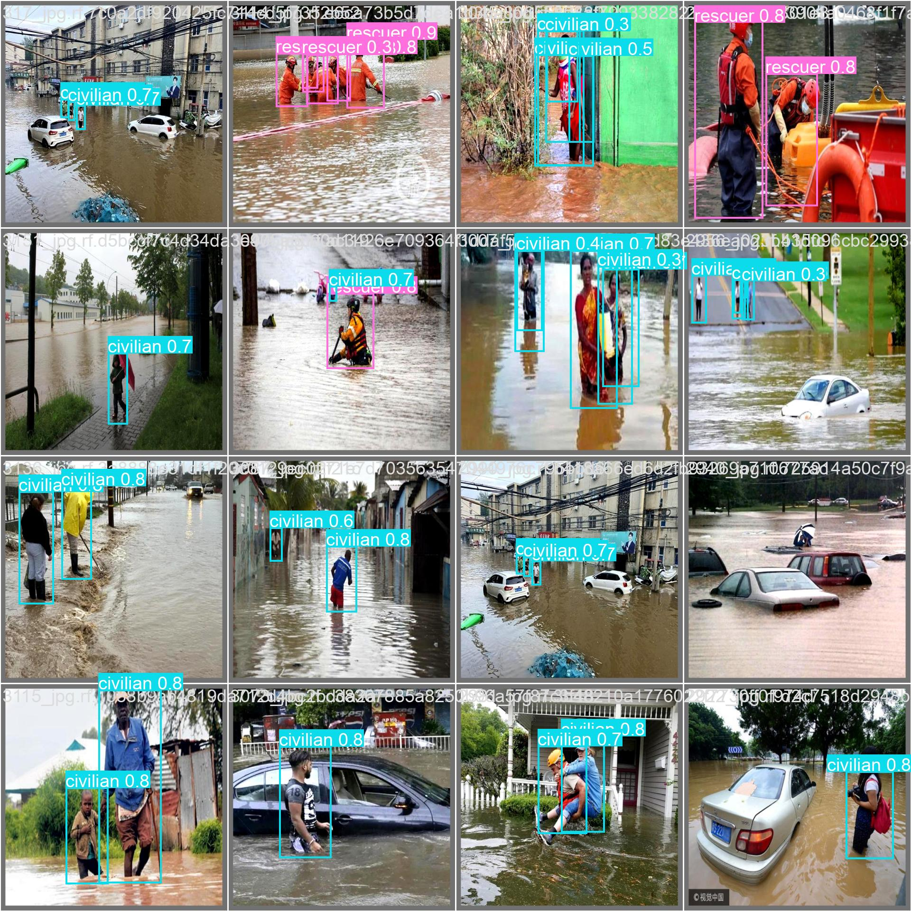

_Etapa de treinamento das imagens_

</div>

---

## 📊 Resultados e discussões

### Análise de Resultados e Métricas

A avaliação da eficácia do modelo foi realizada através de um conjunto de métricas quantitativas e qualitativas, fornecendo uma análise abrangente do seu desempenho:

- **Métricas de Precisão Média (mAP)**:
  - **mAP@0.5**: _Mean Average Precision_ calculada com um _IoU (Intersection over Union)_ _threshold_ de 0.5. Essa métrica é comumente utilizada para avaliação rápida da precisão de detecção.
  - **mAP@0.5:0.95**: _Mean Average Precision_ calculada em múltiplos _thresholds_ de _IoU_, variando de 0.5 a 0.95 em etapas de 0.05. Essa métrica oferece uma medida mais robusta e abrangente da acurácia de localização e classificação das detecções.
- **Precisão (Precision) e Recall (Revocação)**: Avaliados por classe para compreender o desempenho individual na identificação de civis e socorristas, indicando a proporção de detecções corretas e a capacidade do modelo de encontrar todas as instâncias relevantes, respectivamente.
- **Matriz de Confusão (Confusion Matrix)**: Essencial para visualizar e analisar os tipos de erros (falsos positivos, falsos negativos) cometidos pelo modelo, especialmente a confusão entre as classes de interesse, o que é crítico em cenários onde a distinção entre civis e socorristas é vital.
- **Análise Qualitativa**: Serão apresentadas visualizações das _bounding boxes_ e rótulos de classe sobre as imagens de teste. Essa análise visual permite uma avaliação subjetiva da acurácia das detecções e da capacidade do modelo de lidar com variações de escala, oclusão e iluminação.
- **Curvas de Confiança**: Avaliação detalhada das curvas de F1, Precision e Recall em função dos thresholds de confiança, permitindo identificar o ponto ótimo de operação do modelo para balancear precisão e sensibilidade.
- **Identificação de Gargalos**: Através da análise dos falsos positivos e falsos negativos, destacam-se as classes com maior confusão, especialmente entre "civilian" e "background", bem como desafios na detecção de animais menores como "dog" e "cat".

Essa análise abrangente foi fundamental para orientar melhorias futuras no pipeline, visando maior robustez e confiabilidade do sistema em aplicações reais no monitoramento de desastres urbanos.

### Avaliação em Imagens Estáticas

Foram realizados testes qualitativos em imagens fora do treinamento de alagamentos para validar a capacidade de detecção do modelo YOLOv11 treinado em 50 épocas.

<div align="center">

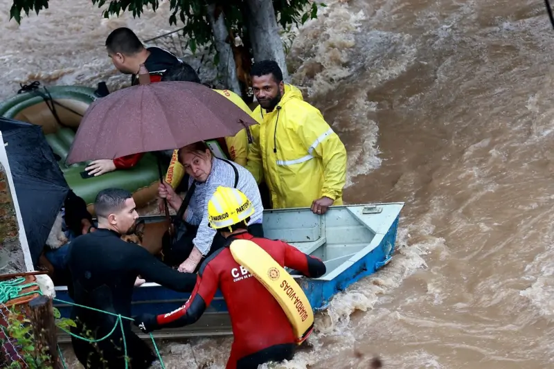
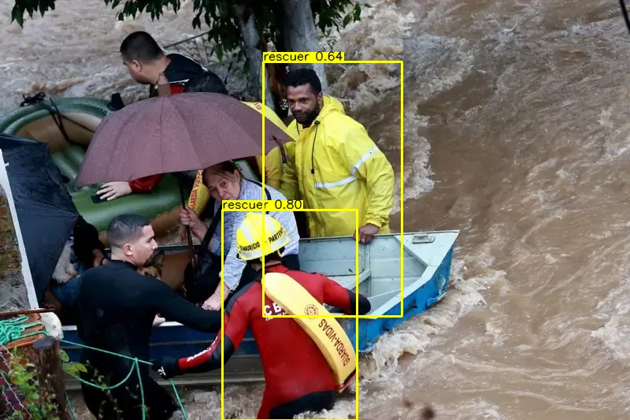

</div>
                                 <!-- COLOCAR AS IMAGENS DE ANTES E DEPOIS DO NOVO MODELO -->
<div align="center">

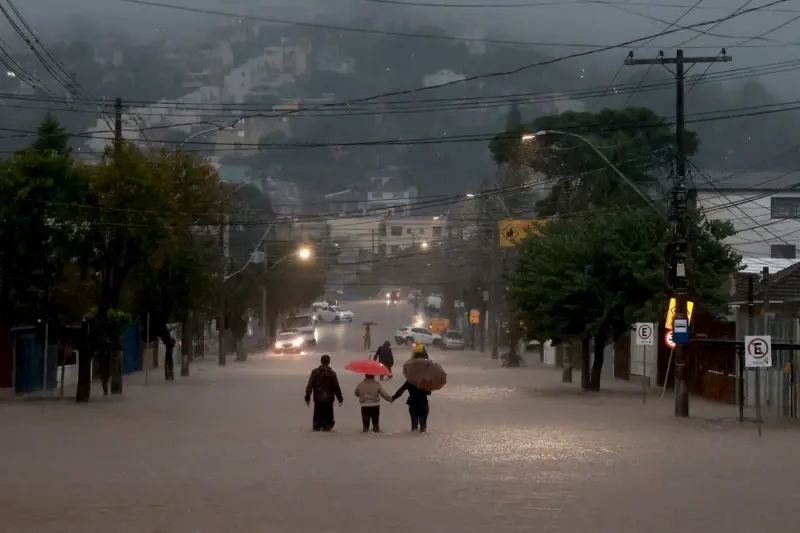
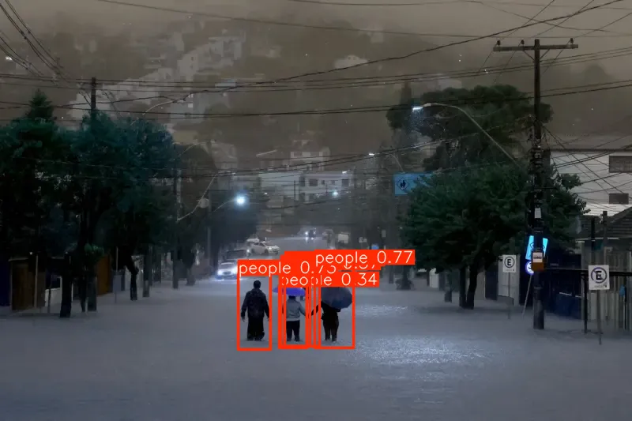

_Fonte: [BBC Brasil - Alagamentos em SP](https://www.bbc.com/portuguese/articles/cw00d51k5rlo)_

</div>

- Com **30 épocas**, o modelo já era capaz de detectar pessoas e socorristas com precisão razoável.
- Com **50 épocas**, observou-se uma melhora clara nas imagens estáticas, com menos falsos positivos, corrigindo erros como a identificação incorreta de pessoas em postes ou áreas de sombra.

### Avaliação em Vídeo

<!-- CRIAR TESTE DE VÍDEO -->

Um vídeo público do YouTube foi utilizado para simular um cenário real de desastre urbano:

<div align="center">


[Vídeo utilizado no experimento](https://www.youtube.com/watch?v=QnFwDqzCwRU)

</div>

- O modelo com **30 épocas** apresentou maior estabilidade e consistência ao longo dos quadros.
- O modelo com **50 épocas**, embora superior para imagens, teve comportamento errático em vídeo, gerando detecções flutuantes e menos confiáveis — sugerindo possível overfitting ou limitação da generalização temporal.

**Observação**: Treinar com mais de 50 épocas pode exigir hardware com maior capacidade de memória. Durante o experimento, o uso da conta acadêmica no Google Colab atingiu o limite de memória, reforçando a necessidade de infraestrutura mais robusta para lidar com sequências temporais (vídeos).

### Gráficos e Visualizações

**30 épocas:**

YOLO11N (modelo Nano):

<div align="center"> 
 
 
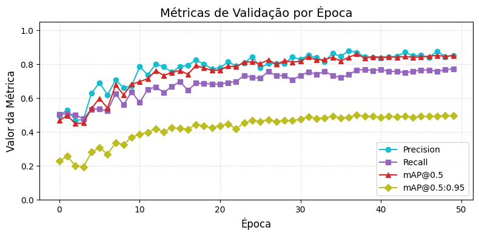 
</div>

YOLO11M (modelo Medium):

<div align="center"> 
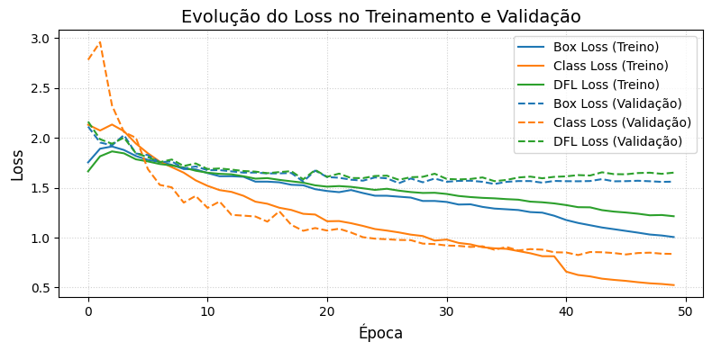
 
 
</div>

### Trabalhos Futuros

- Identificação e classificação avançada de animais em cenários de resgate, incluindo diferentes espécies e estados.
- Integração com dados temporais, utilizando arquiteturas como ConvLSTM e Transformers, para melhorar o acompanhamento de movimentações e a estabilidade das detecções em vídeos.
- Implementação e otimização em sistemas embarcados, como drones e câmeras urbanas, para permitir detecção eficiente e em tempo real no ambiente.
- Expansão da detecção para objetos contextuais relevantes, como destroços, veículos de resgate, barreiras e outros elementos de cena que enriquecem a compreensão do cenário.
- Treinamento com conjuntos de dados mais diversos, incluindo situações noturnas e condições adversas (baixa visibilidade, fumaça, chuva) para aumentar a robustez do modelo.
- Experimentação com aumento do número de épocas de treinamento em ambientes dedicados de alta capacidade computacional para maximizar a convergência e desempenho.
- Refinamento dos hiperparâmetros para aplicações específicas, especialmente em vídeos, visando melhor equilíbrio entre ruído e consistência temporal.
- Desenvolvimento de pipelines para aprendizado contínuo e adaptação dinâmica a novos cenários e classes emergentes.

---

## ✅ Conclusão

- Entre os modelos, **YOLO11M** se destacou por métricas superiores e melhor generalização, indicado para aplicações críticas que demandam alta precisão.
- O modelo **YOLO11N** oferece boa performance com menor custo computacional, sendo adequado para cenários com restrição operacional, como drones e edge devices.
- A análise reforça a importância de técnicas complementares como augmentations, balanceamento de dados e modelagem temporal para aprimorar ainda mais a robustez do Urban Disaster Monitor.
- O uso de infraestrutura dedicada com GPU avançada (Google Colab Pro, NVIDIA A100) é recomendado para permitir treinamentos estendidos e experimentos mais complexos.
  Essas diretrizes fundamentam o desenvolvimento contínuo do projeto, buscando impactar positivamente na capacidade de resposta rápida, segura e eficiente em situações emergenciais urbanas.

---

## 💻 Interface Interativa

A interface foi desenvolvida com **Gradio** e está disponível na Hugging Face.

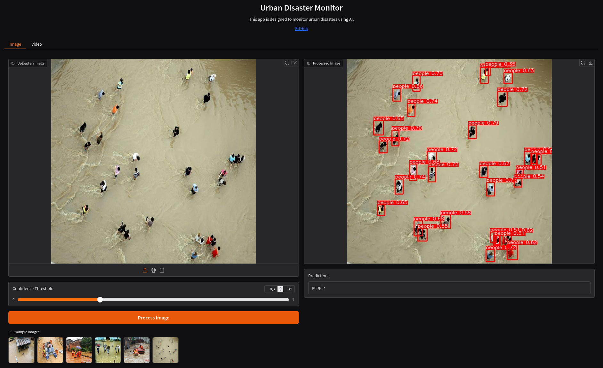

Hospedado com [Hugging Face ](https://huggingface.co)

👉 [Acesse a interface](https://huggingface.co/spaces/carolinasoares/urban_disaster_monitor)

---

## 🛠️ Tecnologias

- [Python 3.10](https://www.python.org/)
- [YOLOv8 (Ultralytics)](https://docs.ultralytics.com)
- [OpenCV](https://opencv.org/)
- [Gradio](https://gradio.app/)
- [Matplotlib](https://matplotlib.org/)

---

## 👥 Equipe do Projeto

O desenvolvimento do `Urban Disaster Monitor` é realizado por alunos da disciplina de Visão Computacional, ministrada pelo professor [Helton Maia](https://heltonmaia.com/) da ECT/UFRN:

| [](https://github.com/jagaldino) | [](https://github.com/MariaCarolinass) | [](https://github.com/heltonmaia) |
| :---------------------------------------------------------------------------: | :---------------------------------------------------------------------------------------: | :-----------------------------------------------------------------------------: |
|                           **jagaldino** Pesquisador                           |                             **MariaCarolinass** Pesquisadora                              |                       **heltonmaia** Professor Orientador                       |

---

## 🚀 Como Executar

Baixe o repositório:

```bash
git clone https://github.com/MariaCarolinass/urban-disaster-monitor.git
cd urban-disaster-monitor/app
```

Crie e ative o ambiente virtual venv:

```bash
python3 -m venv venv
source venv/bin/activate
```

Instale as bibliotecas:

```bash
pip install -r requirements.txt
```

Execute o projeto:

```bash
python app.py
```

---

## 📄 Licença

Urban Disaster Monitor é licenciado sob a Licença MIT encontrada no arquivo [LICENSE](https://github.com/MariaCarolinass/urban-disaster-monitor/blob/main/LICENSE.txt) no diretório raiz deste repositório.

---

## 📚 Referências Bibliográficas

- Projeto SPICI (Smart Platform for Images and Critical Information). Disponível em: [https://smlab.imd.ufrn.br/projeto-spici/](https://smlab.imd.ufrn.br/projeto-spici/)
- Ultralytics. **YOLOv8 Documentation**. Disponível em: [https://docs.ultralytics.com](https://docs.ultralytics.com)
- Roboflow. Disponível em: [https://roboflow.com](https://roboflow.com)
- Redmon, J.; Farhadi, A. (2018). **YOLOv3: An Incremental Improvement**. _arXiv preprint arXiv:1804.02767_. Disponível em: [https://arxiv.org/abs/1804.02767](https://arxiv.org/abs/1804.02767)
- Redmon, J.; Divvala, S.; Girshick, R.; Farhadi, A. (2016). **You Only Look Once: Unified, Real-Time Object Detection**. In: _Proceedings of the IEEE Conference on Computer Vision and Pattern Recognition (CVPR)_, pp. 779-788. Disponível em: [https://arxiv.org/abs/1506.02640](https://arxiv.org/abs/1506.02640)
